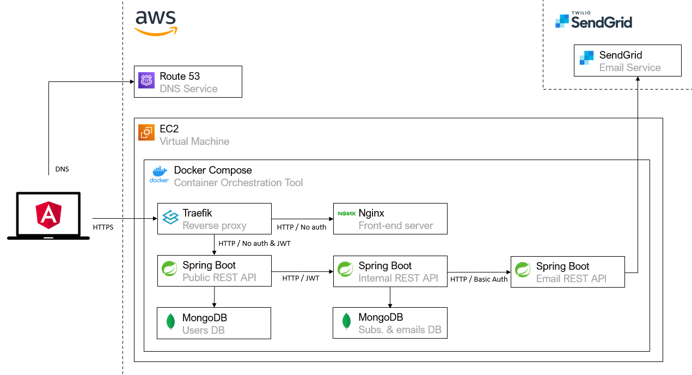

# Adidas Tech Challenge
This repository is the entry point of the proposed solution for the Adidas Tech Challenge for David E. The proposed solution is composed of 3 different microservices, each one in its own repository:

- [Public API](https://github.com/deg93/adidas-subscriptions-public-api): public microservice which handles external requests (from front-end, mobile apps...).
- [Internal API](https://github.com/deg93/adidas-subscriptions-internal-api): microservice focused on manage, persist and notify subscriptions. This microservice is not accessible from Internet.
- [Email API](https://github.com/deg93/adidas-subscriptions-email-api): microservice for sending emails. This microservice is not accessible from Internet.

Please, checkout the previous repositories for more detail on each microservice.

In addition to the microservices, a front-end [Angular app](https://github.com/deg93/adidas-subscriptions-webapp) has been developed.

## Used technologies 
The list below gives a summary of the main technologies used:

- Java 11
- Spring Boot 2.5.8
- MongoDB: NoSQL database used for the persistence layer. Used because its capacity to scale horizontally.
- MapStruct: Java library used to map MongoDB entities to plain DTO objects (all the microservices return DTO objects to their clients).
- Java JWT ([jjwt](https://github.com/jwtk/jjwt)): Java library used to generate and decode JSON Web Tokens (JWT). [Public API](https://github.com/deg93/adidas-subscriptions-public-api) and [Internal API](https://github.com/deg93/adidas-subscriptions-internal-api) use JWTs to authenticate users.
- SpringFox: Swagger library for the Java ecosystem. Used to generate API docs.
- Thymeleaf: Template engine used to generate emails.
- Traefik: reverse proxy used to publish services to the network.
- Docker Compose: container orchestration tool used to deploy every service (microservices, Traefik, databases and front-end app).
- Angular 13: JavaScript framework used by the front-end app.
- NGINX: HTTP server used to serve front-end app.

In order to deploy and publish the [application to Internet](https://adidas-tech-challenge.davidenjuan.es/), the next services have been used:

- AWS EC2: an EC2 instance is executing all the services with Docker Compose (microservices, Traefik, databases and front-end app).
- AWS Route 53: DNS service.
- SendGrid: service used to send emails.
- Let's Encrypt: HTTPS certificates provider.
- DockerHub: docker images repository where generated images are saved.
- GitHub Actions: a workflow (pipeline) has been created for every microservice and for the front-end in order to deploy the projects into AWS.

The following diagram shows the proposed architecture at high-level:



## Deployment

As mentioned before, the application has been published in an AWS EC2 instance. To deploy new features and changes to AWS, only is necessary to push changes to the main branch of each project. This is done by a GitHub Action present in every project:

- Public API workflow (pipeline): [deploy-to-aws.yml](https://github.com/deg93/adidas-subscriptions-public-api/blob/main/.github/workflows/deploy-to-aws.yml)
- Internal API workflow (pipeline): [deploy-to-aws.yml](https://github.com/deg93/adidas-subscriptions-internal-api/blob/main/.github/workflows/deploy-to-aws.yml)
- Email API workflow (pipeline): [deploy-to-aws.yml](https://github.com/deg93/adidas-subscriptions-email-api/blob/main/.github/workflows/deploy-to-aws.yml)
- Front-end app workflow (pipeline): [deploy-to-aws.yml](https://github.com/deg93/adidas-subscriptions-webapp/blob/main/.github/workflows/deploy-to-aws.yml)

As a future improvement, these pipelines should run the tests before publishing the image to DockerHub.

To deploy the services in a local environment, the easiest way is to execute the [Docker Compose file for local environment](docker-compose/local/docker-compose.yml):
```
cd /path/to/local/docker-compose.yml
docker-compose pull
docker-compose up -d
```
Once the containers are up and running, a browser can be opened in the following URLs:

- Public API docs: [http://localhost:8080/swagger-ui/](http://localhost:8080/swagger-ui/)
- Internal API docs: [http://localhost:8081/swagger-ui/](http://localhost:8081/swagger-ui/)
- Email API docs: [http://localhost:8082/swagger-ui/](http://localhost:8082/swagger-ui/)
- Web application: [http://localhost:8000/](http://localhost:8080/)

To execute every service individually (without Docker), please, review the README.md file of the desired project.

## Tests

A Postman collection has been created to test the API services. This collection could be found at [postman-tests/adidas-tech-challenge-tests.postman_collection.json](postman-tests/adidas-tech-challenge-tests.postman_collection.json).


